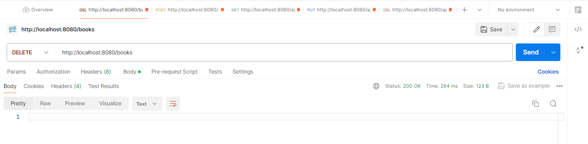

## First Mini-Project with Spring Data JPA
##### `Lab 3:` Spring Boot Data Access with Spring Data JPA and Database Connection
##### `Course:` Enterprise Applications in Java
##### `Master:` Software Engineering
##### `Institutions:` Polytechnic University of Tirana & Lufthansa Industry Solutions

---

##### `Application:` BookCRUDApplication
    Technology stack:
    1️⃣ Spring Boot
    2️⃣ Spring Web
    3️⃣ Spring Data JPA
    4️⃣ PostgreSQL database
    5️⃣ Hibernate

The view on Postman:

Add new Book

`POST /books`

http://localhost:8080/books

Get All Books

`GET /books`

http://localhost:8080/books

Get Book By Id

`GET /books/{id}`

http://localhost:8080/books/{id}

Get Book By Title

`GET /books?title=title`

http://localhost:8080/books?title=title

Edit Book

`PUT /books/{id}`

http://localhost:8080/books/{id}

Delete Book By Id

`DELETE /books/{id}`

http://localhost:8080/books/{id}

Delete All Books

`DELETE /books`

http://localhost:8080/books

